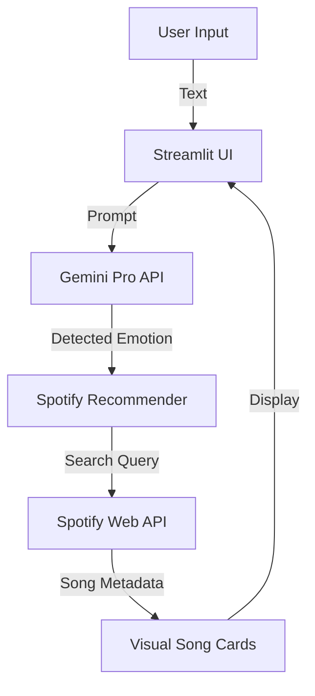

# 🎵 SoulStream (Powered by Gemini)

A premium Generative AI music recommender that detects your mood via **Facial Expression Analysis** and recommends corresponding songs from Spotify based on your vibe.

## Features
- **Facial Emotion Detection** — Uses Gemini 1.5 Flash Vision to analyze your expressions in real-time.
- **Smart Text Fallback** — Can't use the camera? Just type how you feel.
- **Artist & Genre Preferences** — Persistently remember your favorite artists and genres throughout your session.
- **Streamlit UI** — Beautiful, dark-themed, glassmorphism web interface.

## Setup

### 1. Install Dependencies
```bash
python -m venv .venv
.\.venv\Scripts\activate
pip install -r requirements.txt
```

### 2. API Credentials
You need both Spotify and Gemini developer keys. Edit your `.env` file:
```
SPOTIFY_CLIENT_ID=your_actual_client_id
SPOTIFY_CLIENT_SECRET=your_actual_client_secret
GEMINI_API_KEY=your_gemini_key
```

### 3. Run the App
```bash
streamlit run app.py
```

## Project Structure
```
├── .env                    # Credentials
├── requirements.txt        # Minimal Python dependencies
├── model/
│   └── predict.py          # Gemini API Integration logic
├── spotify/
│   └── recommender.py      # Spotify API hit logic
└── app.py                  # Streamlit web application
```

## Architecture



The system follows a reactive flow:
1.  **User Input**: Receives raw text describing feelings.
2.  **Emotion Engine**: Uses Google Gemini Pro to identify nuanced emotional states.
3.  **Spotify Linker**: Maps detected emotions to optimized search queries for the Spotify API.
4.  **UI Layer**: Renders a premium, glassmorphism-style interface for the final recommendations.

## Technologies
- **Google Generative AI** (`gemini-1.5-pro`)
- Spotipy (Spotify Web API)
- Streamlit
