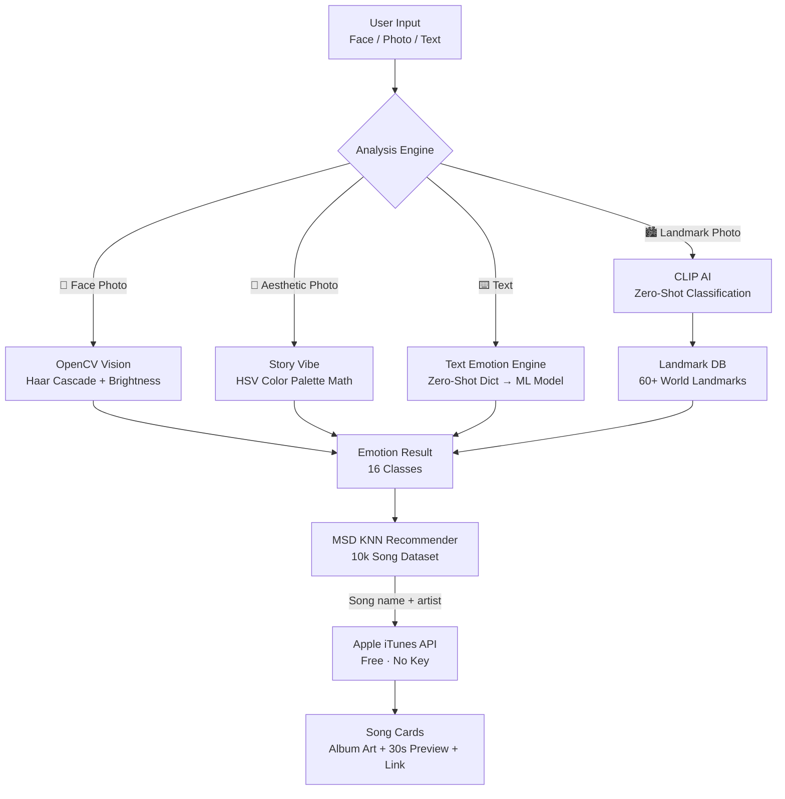

# 🎵 SoulStream

> **Music that matches your soul — powered entirely by local ML, no cloud AI required.**

SoulStream is a fully offline, emotion-driven music recommender built with Streamlit. It detects your mood from your **face, a photo, or typed text** using local machine learning models, then surfaces handpicked tracks with **30-second audio previews** via the free Apple iTunes API.

---

## ✨ Features

| Feature | Description |
|---|---|
| 🎭 **Facial Emotion Detection** | OpenCV Haar Cascades analyze smile presence and lighting to detect mood — no TensorFlow, no cloud calls |
| 📸 **Instagram Story Vibe** | HSV color-palette math reads the aesthetic of any photo (Sunset, Neon, Midnight, Nature…) |
| 🏙️ **Landmark Locator** | HuggingFace CLIP zero-shot AI identifies 60+ famous world landmarks and routes music to that country's iTunes storefront |
| ⌨️ **Text Emotion Engine** | Two-tier NLP: a Zero-Shot keyword dictionary catches 12 complex moods (hangover, gym, adrenaline rush…), then a trained ML classifier handles general sentiment |
| 🌍 **World Music Explorer** | Dedicated page — browse 60+ landmarks by continent or upload a photo to discover local music |
| 🎵 **Apple iTunes Integration** | 30-second previews + full Apple Music links. No login, no API key required |
| 🧬 **Personalization** | Persistent session-level vibe preferences, artist/genre selector dialogs, and sidebar artist multi-select |
| 📡 **Music Region Routing** | 20+ country storefronts — auto-detected from photo GPS metadata or manually selectable |
| 🔎 **Artist Discovery** | Scrapes Last.fm's open similarity graph to expand recommendations from seed artists |

---

## 🚀 Quick Start

### 1. Clone & Install

```bash
git clone https://github.com/Blessonsharon/SoulStream.git
cd SoulStream

python -m venv .venv
# Windows
.\.venv\Scripts\activate
# macOS / Linux
source .venv/bin/activate

pip install -r requirements.txt
```

### 2. (Optional) Environment Variables

The app works **fully offline** without any API keys. The `.env` file is only needed if you want to override defaults.

```env
# .env  (copy from .env.example)
# No Gemini or Spotify key needed — the app is fully local!
```

### 3. Run the App

```bash
streamlit run app.py
```

Open [http://localhost:8501](http://localhost:8501) in your browser.

---

## 🧠 Emotion Taxonomy

SoulStream recognises **16 distinct emotional states**, far beyond basic happy/sad:

| Emotion | Trigger | Music Style |
|---|---|---|
| 😊 Happy | Smile detected / positive text | Pop, indie, upbeat dance |
| 😢 Sad | Low brightness / melancholy text | Acoustic, folk, slow soul |
| 😠 Angry | High overexposure / intense text | Metal, punk, hardcore |
| 😐 Neutral | Balanced face / neutral text | LoFi, ambient, chill |
| 🪩 Party | "clubbing", "rave", "dance" | EDM, house, techno |
| 💋 Lust | "intimate", "romance", "sexy" | RnB, neo soul, slow jam |
| 🤕 Hangover | "hungover", "wasted" | Soft acoustic, singer-songwriter |
| 💔 Breakup | "broke up", "heartbreak" | Sad ballad, indie folk |
| 🌧️ Depression | "depressed", "numb", "hollow" | Dark ambient, minimal drone |
| 🧍 Lonely | "alone", "isolated" | Quiet acoustic, reflective folk |
| 😫 Stressed | "overwhelmed", "deadline" | Alternative rock, noise |
| 😟 Anxiety | "panic", "freaking out" | Moody electronic, dark |
| 🏎️ Adrenaline Rush | "hype", "god mode" | Heavy metal, aggressive bass |
| 🏋️ Gym | "workout", "lifting", "pump" | Trap, hip hop, bass |
| 🏆 Athletic | "game day", "sprint" | Rock, motivational pop |
| ❤️ Love | "in love", "soulmate" | Romantic soul, warm acoustic |

---

## 🏗️ Architecture



### Data Flow

1. **Input** — Camera snapshot, image upload, or typed text
2. **Emotion Detection** — One of four analysis paths runs locally (no API key)
3. **Location Intelligence** — EXIF GPS metadata auto-detects the user's country (optional)
4. **MSD KNN Ranking** — A pre-trained K-Nearest Neighbours model selects the most sonically relevant songs from a 10,000-song local dataset, scored by tempo, loudness, mode, and genre tags
5. **iTunes Enrichment** — Each candidate song is queried against the free iTunes Search API to retrieve official album art, a 30-second audio preview, and a full Apple Music link
6. **Fallback** — If the KNN model is unavailable, a direct iTunes fuzzy-search using emotion keywords is used

---

## 📁 Project Structure

```
SoulStream/
├── app.py                          # Main Streamlit app (multi-tab UI)
│
├── pages/
│   └── 1_World_Music_Explorer.py   # Landmark music discovery page
│
├── model/
│   ├── predict.py                  # Text emotion engine (Zero-Shot + ML)
│   ├── vision.py                   # OpenCV facial emotion detection
│   ├── story_vibe.py               # HSV palette → aesthetic vibe classifier
│   ├── landmark_detector.py        # CLIP AI landmark recognition (60+ places)
│   ├── location_detector.py        # EXIF GPS metadata → country/language
│   ├── dataset.py                  # Emotion → musical keywords mapping
│   ├── train_text_model.py         # Trains the local TF-IDF + SVM text model
│   ├── train_msd_model.py          # Trains the KNN music recommender on MSD
│   ├── dataset_builder.py          # HuggingFace emotion dataset downloader
│   ├── msd_builder.py              # Million Song Dataset CSV preprocessor
│   ├── scratch_train.py            # Quick training script for experiments
│   ├── local_text_model.pkl        # Pre-trained text classification model
│   └── msd_knn_model.pkl           # Pre-trained KNN music recommender
│
├── spotify/
│   ├── recommender.py              # MSD KNN + iTunes recommendation engine
│   ├── artist_discovery.py         # Last.fm scraper for similar artists
│   └── history_manager.py          # Session artist/genre history
│
├── data/
│   ├── local_10k_songs.csv         # 10,000-song curated MSD subset
│   ├── huggingface_emotions.csv    # HuggingFace emotion training dataset
│   └── history.json                # Persistent artist discovery history
│
├── requirements.txt                # Python dependencies
├── .env.example                    # Environment variable template
└── README.md
```

---

## 🔧 Re-Training the Models

The pre-trained `.pkl` files are included in the repo. If you want to retrain from scratch:

### Text Emotion Model (TF-IDF + SVM)
```bash
python model/train_text_model.py
```
Trains on `data/huggingface_emotions.csv` (≈400k tweets/samples). Outputs `model/local_text_model.pkl`.

### Music KNN Model
```bash
python model/train_msd_model.py
```
Trains on `data/local_10k_songs.csv`. Outputs `model/msd_knn_model.pkl`.

---

## 📦 Dependencies

| Package | Purpose |
|---|---|
| `streamlit` | Web UI framework |
| `opencv-python-headless` | Facial + image analysis (Haar Cascades) |
| `Pillow` | Image loading and processing |
| `scikit-learn` | TF-IDF vectorizer + SVM classifier + KNN |
| `pandas` | Dataset loading and manipulation |
| `requests` | iTunes API + Last.fm scraping + Wikipedia |
| `spacy` | NLP support (tokenisation) |
| `python-dotenv` | Environment variable loading |

> **Note:** No Spotify API key, no Gemini API key, and no OpenAI key are required. The app is fully self-contained.

---

## 🌍 World Music Explorer

The dedicated **World Music Explorer** page (`pages/1_World_Music_Explorer.py`) lets you:

- **Upload a photo** of any landmark → CLIP AI identifies it → routes to that country's music
- **Browse by continent** → pick from 60+ pre-mapped landmarks across Europe, Asia, Americas, Africa & Oceania
- Each result shows a Wikipedia thumbnail, country/language info, and 10 locally relevant tracks with previews

---

## 🤝 Contributing

Pull requests welcome! The key extension points are:

- **`model/dataset.py`** — Add new emotion → keyword mappings
- **`model/landmark_detector.py`** → `LANDMARK_DB` — Add new landmarks
- **`spotify/recommender.py`** → `EMOTION_CENTROIDS` — Tune audio feature centroids per emotion

---

## 📄 License

MIT License — free to use, modify, and distribute.

---

<div align="center">
  Built with ❤️ by Blesson Sharon &nbsp;•&nbsp; Fully Offline &nbsp;•&nbsp; No Cloud AI Required
</div>
